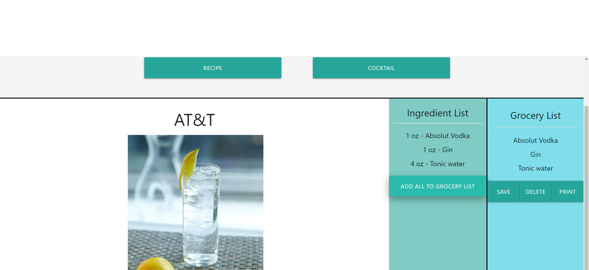

# Brainy Recipes

### Purpose

To design a front-end site that will generate either a recipe or a coktail based on user inputs.

### Built With

- HTML
- CSS
- JavaScript
- JQuery
- Ajax
- Materialize

### Website

Click [here](https://joshuaaldrich.github.io/brainy-badgers-JA/) to view Brainy Recipes Webpage

### Contributions

##### The Brainy Badgers

- Joshua Aldrich: [GitHub](https://github.com/JoshuaAldrich)
- Jorge Garit: [GitHub](https://github.com/jorgegarit)
- Theodore Greer: [GitHub](https://github.com/tdgreer1203)
- Darryl Johnson: [GitHub](https://github.com/HeadbandDandy)

## Deployed Application

### HomePage

The home page features a header with the title of website: Brainy Recipes. The jumbotron contains and input field and two buttons oen that will generate a recipe and one that will generate a cocktail.
It also contains a placeholder chicken recipe with the steps, summary, link to full recipe site, and ingredient list.

### Recipe Search

When the user inputs a proper search parameter and hits the recipe button a recipe will pop up based on the call to the Spoonacular API. That recipe will include its name, an image, the steps to make it, a short summary, links to similar recipes, and a link to a more detailed site. It will also display the ingredient list with measurements.

### Cocktail Search

When the user inputs a proper serach parameter and hits the cocktail button a cocktail will pop up based on the call to the CocktailDB API. That cocktail will include its name, an image, and a description of how to make it. It will also display the ingredient list with measurements.

### Ingredient List

The ingredient list will populate when the call is made to either API. This list will include the the ingredients to make the recipe as well as the requires mesaurements. By double clicking on a specific ingredient you can add said ingredient to the grocery list. You can also click the add all to grocery list to move all ingredients to that list.

### Grocery List

The grocery list will populate when either an specific ingredient is double clicked or when the add all to grocery list button is clicked. From there you can remove a specific item by double clicking it, you can also delete the entire list by pressing the delete button. If you wish to save the list you can hit svae and it will add it to localStorage and appear when the page is reloaded. As you add more ingredients they will populate below the ones already on the list.

Lastly, if you chosse you can hit print and a pop up print window will appear that will allow you to either print the list or save it as a pdf.

### Error/Modal

If the user input returns a value of null or returns zero results a modal will pop up advising the user that the input was incalid and also offers suggestions of valid inputs.

### Mobile Screen Display

Even on a mobile device the user is able to access our website for their recipes and cocktails in case they're in the grocery store doing last minute shopping!

##### Hope you enjoy Brainy Recipes 🤓
